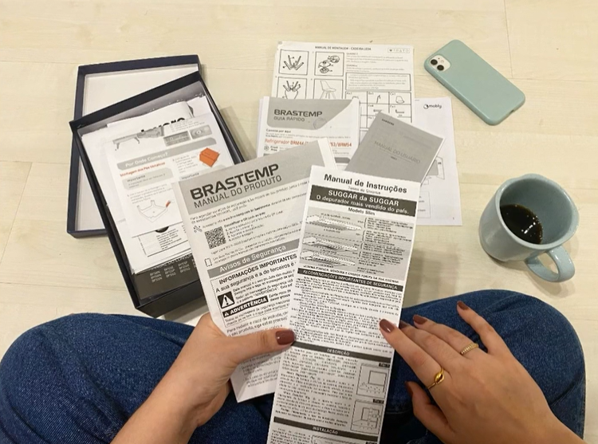
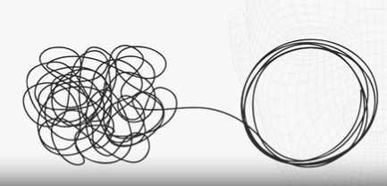
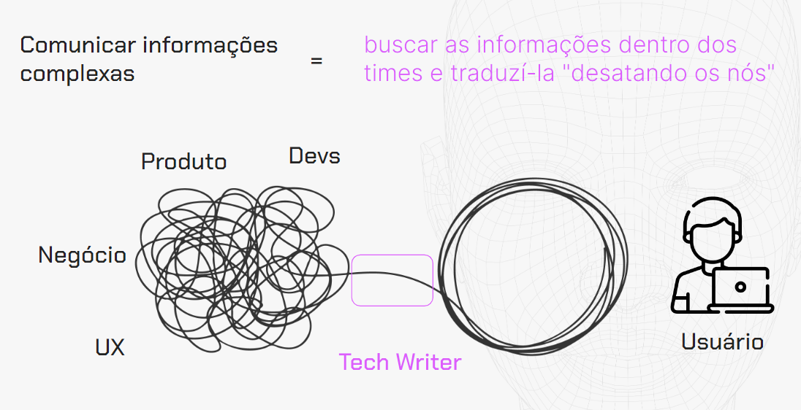

    <video controls width="800">
        <source src="../src/video/M_0_Aula-0.mp4" type="video/mp4">
    </video>

# O que é Technical Writing?
Antes de abordar isso, achamos crucial oferecer um breve contexto e, principalmente, começar a tornar esse assunto mais tangível.

Expressamos isso porque compreendemos que, inicialmente, Technical Writing pode parecer algo distante de nossa realidade, como se nunca tivéssemos tido um primeiro contato com ele. No entanto, estamos aqui para demonstrar o oposto e afirmar que, na realidade, Technical Writing está mais próximo de nossa rotina do que imaginamos. O exemplo mais ilustrativo que podemos oferecer é, literalmente, desta foto.

    

Quem nunca precisou montar um móvel quando estava se mudando? Uma cadeira, uma mesa, ou ainda, compreender como ligar um eletrodoméstico em casa? Apesar de não parecer, todos esses documentos presentes nessa foto já constituem documentações. Assim, cada vez que você adquiriu um produto ou serviço, mesmo sem saber, já estava entrando em contato com o Technical Writing e com a documentação técnica.

Para facilitar ainda mais, decidimos apresentar dois exemplos que compartilharemos em nossa tela agora. O primeiro é um [manual](../../src/pdf/manual-de-montagem.pdf) que encontramos na internet sobre montagem, e observe o quão interessante é. Por que isso constituiria uma documentação técnica? Porque, em primeiro lugar, há uma foto do móvel, nos permitindo visualizar como é o produto.

Ao abrir a embalagem, confirmamos se é o produto que adquirimos, proporcionando um contexto à pessoa usuária. Em seguida, encontramos uma variedade de informações técnicas, como os detalhes técnicos do sofá, incluindo a composição do estofamento, tecido, etc., que podem ser úteis.

Reconhecemos que, normalmente, lemos e não internalizamos a importância disso. No entanto, para prestadores de serviço ou para aqueles que precisam verificar o padrão de qualidade, isso é crucial. Além disso, proporciona visibilidade para nós, pessoas usuárias, sendo uma transparência em relação ao produto e serviço que adquirimos. Inclui informações essenciais, as partes do sofá e suas dimensões, seguidas pelas etapas de montagem.

Perceba que, mesmo sendo um produto simples, como um sofá com estofado, observe como foi documentado de maneira que conseguimos compreender exatamente tudo sobre ele. Compreendemos sua composição, tamanho, partes e todas as etapas necessárias para, ao final, obtermos precisamente esse sofá a partir do início.

Agora, exemplificando mais proximamente com a tecnologia, evitando abstração em relação aos móveis, apresentamos outro caso de produto intimamente ligado ao nosso cotidiano, especialmente pós-pandemia: o [Zoom](https://support.zoom.com/hc/pb/meetings?id=meetings) , um aplicativo de videoconferências e reuniões. Note o quão fascinante é essa documentação disponível no suporte do Zoom, repleta de conteúdos que instruem sobre o uso do aplicativo.

Sabemos que, talvez, para você que trabalha em tecnologia ou está muito inserido nesse contexto, pode parecer algo muito óbvio, mas precisamos considerar que podem ter pessoas novas começando a usar a ferramenta e que não têm o mesmo contexto. Portanto, ter essas documentações é fundamental para contextualizar para a pessoa usuária como são os recursos do Zoom, e, acima de tudo, como usá-los no dia a dia.

Vamos abrir um exemplo de como ingressar em uma reunião, clicando em "How to join a meeting" (como entrar em uma reunião). O tutorial fornece todas as etapas necessárias, incluindo um recurso adicional de vídeo do lado direito que podemos reproduzir para visualizar o procedimento completo. Além da opção de reunião, existem outras funcionalidades, como conectar o áudio e personalizar o fundo do quadro em videochamadas, entre outras opções.

Até o momento, acreditamos que já conseguimos provar que isso está realmente muito próximo do nosso dia a dia. Technical Writing está mais próximo da nossa realidade do que pensamos no primeiro contato.

 

## O que é Technical Writing?
Technical Writing envolve comunicar informações complexas para aqueles que precisam realizar uma tarefa ou atingir um objetivo.

Em outras palavras, trabalhar com Technical Writing é exatamente fazer esse exercício de comunicar informações, ou seja, traduzir essas informações que, num primeiro contato, parecem complexas e pouco acessíveis, com o objetivo de transformar tudo isso em conteúdos que sejam úteis e acessíveis para o nosso público.

    

Para facilitar ainda mais e mostrar um pouco como é a nossa dinâmica de trabalho no dia a dia, resolvemos trazer uma imagem que gostamos muito e que acreditamos que ilustra bastante como é o nosso dia a dia de trabalho, mas, acima de tudo, o objetivo que, no final das contas, temos.

Costumamos dizer que comunicar informações complexas dentro das empresas é exatamente ter esse objetivo de comunicar com diferentes áreas para pegar essas informações e transformá-las em conteúdos que sejam acessíveis. A sensação que dá é quase essa mesma, de visualizar várias informações circulando entre os times.

Por exemplo, nessa imagem, poderíamos ter o time de desenvolvimento, de produto, de negócio, de UX, entre outros que poderiam também aparecer nessa conjuntura. Eles estão criando informações, criando produtos ou atualizando funcionalidades de um produto, estão criando insumos para o nosso trabalho.

Muitas vezes, essa criação é desordenada, ou seja, ela está acontecendo de uma forma extremamente orgânica e que está a todo vapor, as sprints estão acontecendo nos times e esses insumos estão sendo gerados.

Nosso objetivo dentro das empresas, ao gerenciar esse conhecimento, é precisamente tentar desatar esses nós, buscando essas informações nos times para começarmos a desembaraçar essas informações.

Nesse momento é que entramos no fluxo, desembaraçando essas informações para que, no final da ponta, onde está a pessoa usuária final – seja ela técnica ou não, pois o público final pode incluir desenvolvedores, por exemplo –, essa pessoa visualize essa linha enrolada sem nenhum nó, sem nenhum embaraço.

    

  

Diríamos que esse é o nosso principal objetivo, estamos dentro das empresas para pegar essas informações que são muitas vezes criadas, mas elas não são organizadas de uma forma que fica acessível não só para nós que estamos criando esse produto, mas principalmente para você que é pessoa usuária final e que precisa consumir um produto ou serviço.