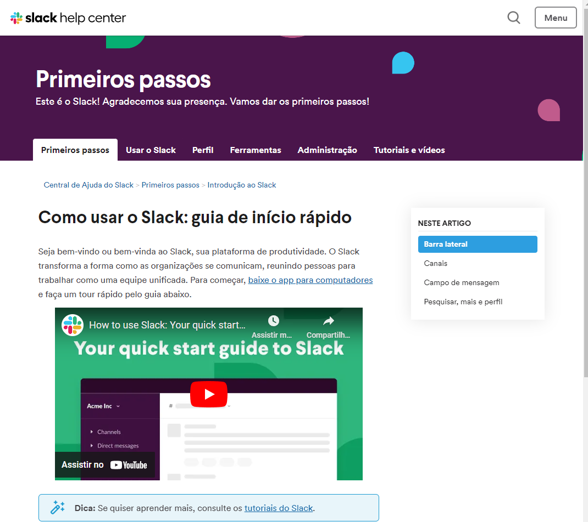
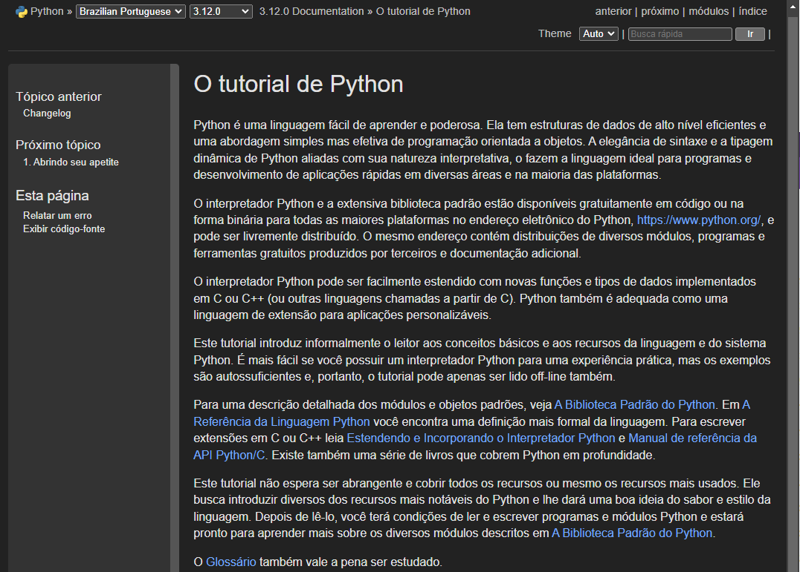
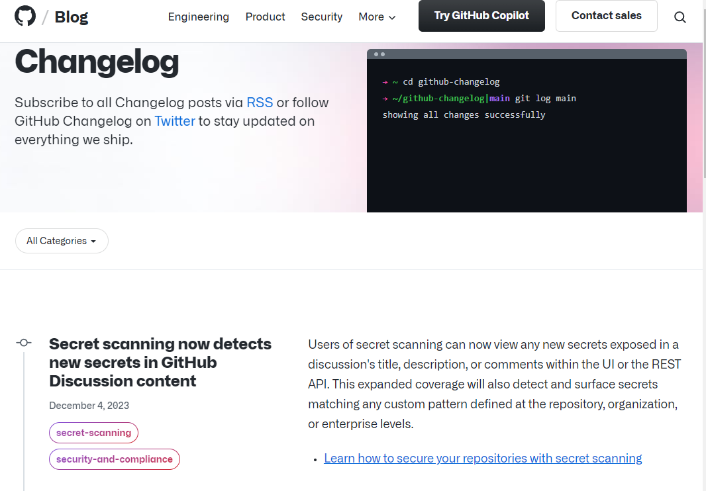

# Quais processos de trabalho um TW pode ter?
Se você já se questionou sobre os bastidores de um Technical Writer (TW), está prestes a desvendar os processos que impulsionam essa profissão essencial. Prepare-se para uma jornada informativa e objetiva sobre o que acontece nos corredores por onde passa a escrita técnica.

Existem diversos tipos de entrega de Technical Writers, sendo os mais comuns:

 

### Documentação de Produto
Imagine um manual de usuário que descomplica até a tarefa mais complexa. Esse é o trabalho do TW na documentação de um produto. Seja um app, dispositivo ou software, a arte de transformar termos técnicos em uma linguagem amigável é o que diferencia um bom TW.

Podemos visualizar essa aplicação no Guia de Início Rápido do Slack, o qual tem instruções claras e visuais, o que facilitam a compreensão até para as pessoas menos familiarizadas com tecnologia.

    

  

 

### Manuais Técnicos
Se existe um problema, há um manual técnico. Aqui, a pessoa TW se torna quem auxilia a traduzir os intrincados detalhes técnicos em palavras realmente compreensíveis. Imagine guias que transformam códigos complexos em passos simples. Incrível!

Os guias do Python não só explicam a linguagem de programação, mas fornecem também exemplos e casos de uso, facilitando a compreensão para devs de todos os níveis.

    

  

 

### Comunicação com DEVS
Profissionais de TW atuam como uma ponte entre devs e outros departamentos. Comunicar atualizações, alterações e melhorias de maneira clara é fundamental para garantir que todas as pessoas envolvidas estejam na mesma página.

Essas comunicações podem acontecer através de release notes, changelogs, e-mails ou na próprio Developer Portal (site focado em oferecer todos recursos que devs precisam saber de um produto, inclusive documentações)

Dessa maneira, podemos pensar sobre o GitHub, que usa changelogs eficazes para informar pessoas usuárias sobre as últimas atualizações, mantendo a comunidade bem informada.

    

  

 

# Modelos de Trabalho em Technical Writing
Na área de TW, duas abordagens se destacam de acordo com o livro "The Product is Docs", considerado leitura primordial para quaisquer profissionais neste campo:

 

### Participação Direta
Ao adotar o modelo de Participação Direta, a pessoa Technical Writer (TW) não é apenas uma observadora externa, mas uma peça integral no quebra-cabeça do desenvolvimento do produto. Integrando-se ao time de produto, a TW se insere na esteira de desenvolvimento desde seu início.

- Vantagens: Compreensão Rápida: Profissional de TW, imersa no dia a dia do time de produto, absorve rapidamente as nuances e complexidades do produto em desenvolvimento. Isso possibilita uma compreensão profunda e ágil das funcionalidades e requisitos.

- Desafios: Limitação de Compartilhamento: A proximidade intensa com um único time pode criar barreiras no compartilhamento de aprendizados com outros setores da empresa. A pessoa TW pode estar tão imersa em um projeto específico que compartilhar suas experiências pode vir a se tornar um desafio.

 

### Scrum of Writers
No modelo Scrum of Writers, os TWs formam um time dedicado, trabalhando de maneira transversal nos diversos times de produto da organização. Nessa abordagem, o TW se põe como regente, onde cada pessoa contribui para diferentes projetos de maneira coordenada.

- Vantagens: Atuação em várias frentes: A equipe Scrum of Writers pode colaborar em múltiplos projetos simultaneamente, trazendo uma perspectiva ampla e habilidades especializadas para diferentes contextos. Isso possibilita a validação de processos em diversos times.

Escalonamento do Conhecimento: Ao centralizar um time focado em documentação, a disseminação do conhecimento torna-se mais eficiente. Os TWs conseguem escalar suas habilidades, compartilhando melhores práticas e padrões de documentação em toda a empresa.

- Desafios: Envolvimento Tardio: Uma possível desvantagem é que, ao atuar transversalmente, os TWs podem chegar à cena apenas na etapa final do ciclo de desenvolvimento. Isso pode resultar em uma participação mais limitada nas fases iniciais do projeto.

 

Em ambos os modelos, a pessoa TW desempenha um papel crucial, seja como membro integral de um time específico ou como parte de uma equipe transversal. A escolha entre essas abordagens dependerá das necessidades específicas da empresa e da dinâmica do seu ambiente de desenvolvimento de produtos.