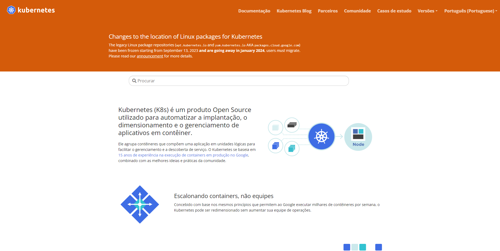

# Docs as Code
Se a ideia de descomplicar coisas técnicas te atrai, então o "Docs as Code" (Docs como Código) pode ser a abordagem que você procura. Dessa forma, tal prática nos aproxima do cerne do produto, uma vez que trazemos a documentação para o mesmo ecossistema técnico de código, onde está geralmente o produto que documentamos.

## O que é Docs as Code?
Imagine tratar a documentação como um projeto de software. Isso mesmo, como se fosse código. O "Docs as Code" é exatamente isso. Agora, os documentos têm seu próprio código-fonte, versões e podem passar por revisões, assim como qualquer outro projeto de software. Assim, TWs aplicam essa filosofia de maneira natural.

Podemos pensar nisso em ação em casos como, por exemplo, o [Kubernetes](https://kubernetes.io/pt-br/), projeto de código aberto utilizado para automatizar a implantação, o dimensionamento e o gerenciamento de aplicativos em contêiner, agrupando esses contêineres que compõem uma aplicação em unidades lógicas para facilitar o gerenciamento e a descoberta de serviço.

Por se tratar de um projeto de código aberto, o Kubernetes hospeda a sua documentação em um repositório público no Github, permitindo que haja contribuições à documentação de forma colaborativa entre pessoas desenvolvedoras, já que o código do projeto e as documentações compartilham do mesmo projeto (no caso, repositório).

    

  

### Colaboração Fácil
O grande ponto sobre o Docs as Code está na colaboração fácil, assim, todas as pessoas envolvidas, de desenvolvedoras a redatoras técnicas, podem contribuir como se estivessem mexendo em linhas de código. Isso acelera o processo, mantendo todos e todas na mesma página.

### Benefícios para Manutenção
Uma grande vantagem na aplicação de Docs as Code é a facilidade na manutenção. Imagine atualizar a documentação como se estivesse fazendo um commit no seu código. É eficiente, rápido e mantém a documentação sempre alinhada com as últimas alterações do projeto, assim como o histórico de tudo fica armazenado nos pull requests, o que gera ainda mais benefícios.

### Controle de versionamento
Quanto ao Controle de Versionamento, estamos abordando uma prática essencial no universo do desenvolvimento de software e, por extensão, no Tech Writing. No contexto de Docs as Code, o controle de versionamento é como a trilha de migalhas que nos guia através das mudanças na documentação.

Assim como no código-fonte, onde cada alteração é registrada, no Controle de Versionamento para Docs as Code, cada revisão na documentação recebe sua própria versão. Isso permite rastrear o progresso, entender as mudanças e, se necessário, retroceder para uma versão anterior. Essa transparência é crucial para manter a coesão entre a documentação e o código em evolução.

### Modelo de entrega contínua
Referente ao Modelo de Entrega Contínua, ele é como a cereja do bolo para o processo. Imagine uma entrega contínua não apenas para o código, mas também para a documentação. Por se tratar de uma abordagem de documentação dentro de ferramentas comuns à programação, você consegue configurar o seu repositório para ter, por exemplo, uma "esteira" mais automática em que toda vez que uma mudança de documentação é recebida, alguns passos aconteçam.

Dessa forma, é quase como ter atualizações automáticas para o manual do usuário. Isso garante que a documentação esteja sempre sincronizada com as últimas funcionalidades do produto.

Ao integrar o Modelo de Entrega Contínua, você garante que as melhorias na documentação sejam entregues de forma ágil, mantendo-a relevante e útil. É a promessa de um ciclo de vida mais eficiente, onde a documentação evolui em paralelo com o próprio produto.