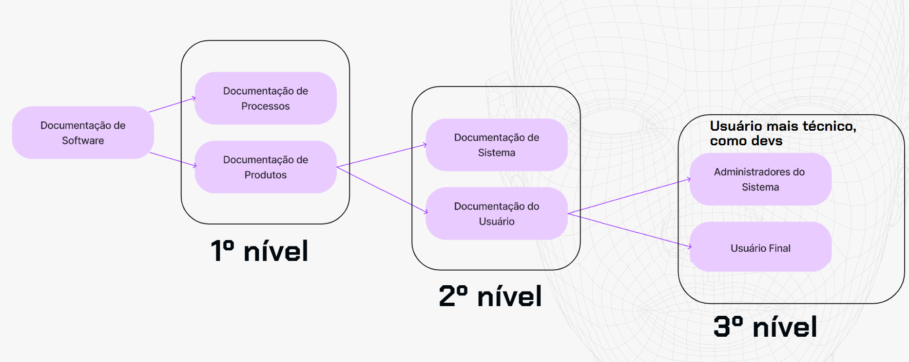

    <video controls width="800">
        <source src="../src/video/M_1_Aula-0.mp4.mp4" type="video/mp4">
    </video>

# O que é Documentação Técnica?
De uma forma bem resumida, uma documentação nada mais é que um documento que pode, ou não, reunir uma série de outros documentos que trazem informações importantes sobre como a pessoa vai usar um produto ou serviço. 

Uma documentação precisa evidenciar qual é o seu objetivo. Muitas vezes, uma documentação pode abrigar várias outras. Isso é importante frisar, porque, às vezes, quando começamos a documentar, é quase tentador querer escrever em um só documento várias coisas.

Porém, até mesmo pelo tipo de documentação que iremos apresentar, você vai entender a importância de sempre ter um objetivo claro para cada documento, pois, assim, conseguimos separar melhor os assuntos e, para a pessoa usuária, fica mais fácil também absorver a informação.

Considerando que a documentação é esse grande documento, esse grande conteúdo que reúne informações para ajudar a pessoa usuária a entender as principais informações de um produto, que tipo de ações esperamos geralmente com uma documentação?

Essa ajuda geralmente diz respeito a configurar, a instalar, a personalizar alguma coisa ou, então, a conhecer e entender melhor sobre determinado assunto ou determinada funcionalidade de um produto, ou ainda adicionar e eliminar.

Existem outros verbos que poderíamos listar, mas acreditamos que esses são os mais comuns que você pode encontrar. Entretanto, não se limite a eles; esse é apenas um exercício para você começar a assimilar e entender exatamente quais são os tipos de assuntos que uma documentação técnica costumam abordar, ainda mais no contexto de desenvolvimento de software.

 

## Fontes de verdade
Um ponto essencial é que o exercício de documentar, de pegar uma informação muito técnica, traduzi-la e torná-la acessível para um público, além da importância dessa experiência que fornecemos para a pessoa usuária, também é sobre algo da nossa área chamado Single Source of Truth (Fonte Única da Verdade).

Muitas vezes, quando escrevemos sobre um produto ou serviço, a pessoa usuária pode ter acesso a muitas fontes sobre esse mesmo produto, como sites da internet que falam sobre o nosso próprio produto.

Quando documentamos, criamos uma fonte de verdade para essa pessoa usuária, uma fonte fiel, uma fonte confiável. Essa pessoa saberá que, ao entrar nessa documentação, irá encontrar as principais informações necessárias.

Portanto, esse exercício de documentar também contribui para construir fontes de verdade. Seja para um público externo ou mesmo uma documentação para o time com o qual trabalhamos, estamos construindo uma fonte de verdade, porém, dessa vez, para as pessoas internas que estão dentro do projeto, ou então outras áreas que trabalham com o time em que você atua.

 

## Tipos de documentação
Uma vez que entendemos o que é uma documentação, que ela existe para reunir informações importantes para o uso e que contribuem para a fonte da verdade, a partir desse conceito maior da documentação, como começamos a pensar nos seus determinados tipos?

    

  

O ***primeiro nível*** é o que ele diferencia, dentro de documentação de software, o que seria uma <u>documentação de processos e uma documentação de produtos</u>.

- A ***documentação de processos*** é muito comum quando trabalhamos com pessoas que atuam na área de produto, e seriam aquelas documentações de cronograma, estimativa, todos esses documentos que ajudam a mapear os processos de alguma coisa, ou ainda os processos mesmo do próprio produto, não só da produção dele, mas de como ele funciona.

- A ***documentação de produtos*** vai entrar mais ainda no detalhe. Se a de processos é como se fosse uma espécie de documentação de bastidores, essa será uma documentação que entra a fundo, que mergulha no produto, entende como ele funciona, quais são as suas características, como usá-lo, como não usá-lo, entre outras possibilidades.

Esse é o primeiro nível, em que você pode ter a documentação de processos ou de produtos.

Mais a fundo, em um ***segundo nível***, temos o que a Prototypr descreveu como a documentação de sistema ou a documentação da pessoa usuária.

- A ***documentação de sistema*** pode ser entendida como aquela documentação mais técnica, que geralmente traz as diretrizes de como construir uma solução, em relação ao framework, à arquitetura, enfim, um lado mais de código e técnico de operação do sistema.

- Já a ***documentação da pessoa usuária*** seria a documentação para o público direto a que se destina esse software.

No ***terceiro nível***, temos ainda duas possibilidades de pessoa usuária, porque podemos ter tanto a <u>pessoa usuária final</u>, que somos nós, por exemplo, se usamos um aplicativo, ou ainda o que ele chama de <u>administradores do sistema</u>, que nada mais são do que uma pessoa usuária mais técnica.

Vamos dar um exemplo de empresa em que a instrutora já trabalhou. Geralmente, ela fazia a documentação de produto para a pessoa usuária e era administradora de sistema, porque essa pessoa usuária era uma pessoa desenvolvedora.

Ela escrevia sobre produtos técnicos para um público igualmente técnico. Não necessariamente era uma pessoa usuária final, como a pessoa Tech Writer do Zoom que vimos como exemplo no começo do curso, que precisou escrever sobre como a pessoa usuária final entraria em uma reunião.