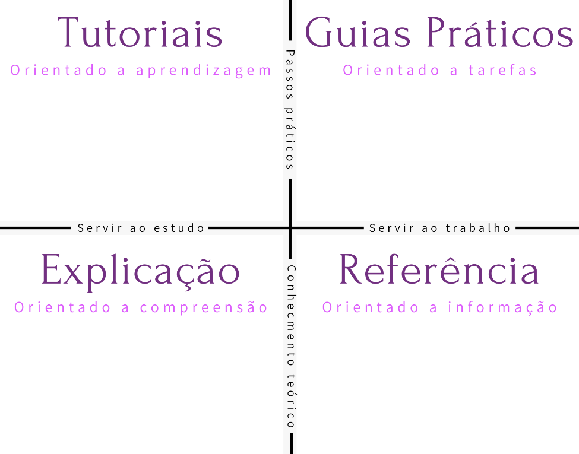

    <video controls width="800">
        <source src="../src/video/M_1_Aula-2.mp4" type="video/mp4">
    </video>

# Tutoriais e guias how-to
Antes de prosseguir, é importante entender que a definição de um tipo de documentação pode variar de acordo com o framework de documentação usado. No caso da Diátaxis, há uma distinção entre tutoriais e guias how-to que precisa ser feita.  

O Diátaxis trabalha com quatro principais tipos de documentação e classifica cada um deles de acordo com alguns critérios. Observe a imagem abaixo:

    

 

Para o propósito desta aula, vamos focar apenas em **tutoriais** e **guias práticos**.

O Diátaxis foi criado por **Daniele Procida**, um diretor de engenharia de uma empresa internacional. Ele é muito conhecido na comunidade de *Tech Writing* e criou esse framework com o objetivo de simplificar as classificações de documentação e estabelecer objetivos mais claros para esses quatro grandes grupos.

A abordagem de Procida para a documentação é focada na **qualidade** e nas **necessidades**. Ele estabelece que tutoriais e guias práticos estão dentro do eixo de **passos práticos**. Os tutoriais servem ao **estudo** e os guias how-to servem ao **trabalho**.

Daqui para frente, vamos entender melhor o que seria esse campo do trabalho e do estudo que o Daniele menciona. Por enquanto, é interessante fixar que, apesar de tutoriais e guias práticos estarem na mesma altura, eles são separados a partir do momento em que entendemos que o tutorial está orientado a **aprendizagem** e o guia how-to está orientado a **tarefas**.

 

## Tutoriais e guias how-to: semelhanças
Ambos, tutorial e how-to, são documentações de **passo a passo** que guiam a pessoa usuária no que ela precisa para **atingir um objetivo**. As perguntas que orientam a escrita de ambos são: qual é a ação que precisa ser realizada e quais são os passos necessários para atingir esse objetivo.

No entanto, há diferenças na abordagem do Diátaxis. Observe a seguinte fala de Daniele Procida:
> "O tutorial serve a necessidade do usuário no estudo. É sua obrigação oferecer uma experiência de aprendizagem bem-sucedida. O guia how-to serve a necessidade do usuário no trabalho. A sua obrigação é ajudar o usuário a realizar uma tarefa."

A partir dessa citação, fica evidente que, enquanto o tutorial é visto como algo da didática, voltado para a aprendizagem, oferecendo um passo a passo com uma didática atrelada, um objetivo de fixar o conhecimento como aprendizado, o how-to é mais objetivo e pragmático, para realizar uma tarefa.

Por que é feita a diferenciação entre trabalho e estudo?

Imagine a seguinte situação: você está fazendo um curso. Tudo que falamos, tem o objetivo de aprendizagem, de fixar esse conhecimento. Se nosso foco fosse em uma abordagem how-to, não nos preocuparíamos em contextualizar tanto e passaríamos todos os passos necessários para realizar algo.

Quando estudamos, temos tempo e queremos nos aprofundar nos detalhes. Já em um contexto de trabalho, precisamos ser mais rápidos, porque temos um objetivo imediato a cumprir.

 

## Tutoriais e guias how-to: diferenças
Agora, vamos analisar uma tabela para tornar essas diferenças ainda mais evidentes: 

    

 

Tutoriais descrevem o passo a passo de maneira detalhada, porque existe uma preocupação com o aprendizado. Eles buscam dar os porquês, justificar, contextualizar o máximo que puder. Além disso, normalmente, consumimos tutoriais quando aprendemos algo do zero.

Já os guias how-to têm uma descrição de passo a passo focada apenas em realizar a tarefa. Eles não têm a mesma preocupação em contextualizar que os tutoriais. Geralmente, o título começa com "Como…" ou já é um verbo direto, por exemplo, "Como criar uma conta na ByteBank" ou "Criar uma conta na ByteBank".

Por fim, considerando a comparação de quando estamos aprendendo algo em programação, o guia how-to seria consultado quando já programamos e queremos recapitular como fazer algo. Dessa forma, não há uma preocupação em contextualizar as etapas.

Para ilustrar, temos exemplos de tutoriais e guias how-to da Microsoft e do nosso projeto de curso.

O primeiro exemplo é um tutorial da Microsoft cujo título é "[Tutorial: criar suas próprias medidas no Power BI Desktop](https://learn.microsoft.com/pt-br/power-bi/transform-model/desktop-tutorial-create-measures)". É a documentação do Power BI, produto de business intelligence da Microsoft, e ela traz inicialmente um sumário.

>**Neste artigo**
> - Pré-requisitos
> - Medidas automáticas
> - Criar e usar suas próprias medidas
> - O que você aprendeu
> - Próximas etapas

Perceba que, logo no início do artigo, é trazido um contexto:
> Usando medidas, você pode criar algumas das soluções de análise de dados mais avançadas no Power BI Desktop. As medidas ajudam você a executar cálculos em seus dados conforme você interage com os relatórios. Este tutorial serve como guia para que você compreenda as medidas e crie suas próprias medidas básicas no Power BI Desktop.

Com isso, é apresentado um porquê para o recurso de usar e criar medidas ser tão importante quando usamos o Power BI. Também é levantado um contexto específico nos pré-requisitos:
> Este tutorial destina-se aos usuários do Power BI já familiarizados com o uso do Power BI Desktop para criar modelos mais avançados. Você já deve estar familiarizado com o uso dos recursos Obter Dados e Editor do Power Query para importar dados, trabalhar com várias tabelas relacionadas e adicionar campos à tela de relatório. Se ainda não estiver familiarizado com o Power BI Desktop, não deixe de conferir a Introdução ao Power BI Desktop.

Perceba a preocupação em, antes de começar o passo a passo, evidenciar quem é o público e o porquê de o público ser quem já conhece determinada funcionalidade. Ao longo do texto, percebemos uma preocupação muito grande com a **fixação do conhecimento**.

Na sequência, temos o início do passo a passo, mas perceba que são textos mais extensos, com uma preocupação em adicionar imagens para tornar cada um dos passos mais fácil de fixar.

Já em um guia how-to, como o "[Editar modelos de dados no serviço Power BI (versão prévia)](https://learn.microsoft.com/pt-br/power-bi/transform-model/service-edit-data-models)", temos um texto mais direto.

Nesse caso, não há um texto que explica para quem se destina a documentação, ou por que devemos estar em determinada etapa de uso do Power BI para ler o guia. Encontramos um documento muito mais direto ao ponto, objetivo, sem preocupação de contextualizar tanto.

No projeto do curso, temos um [modelo de tutorial](https://github.com/marimoreiratw/projeto-alura/blob/main/tutorial.md), iniciado com uma visão geral sobre o que seria a criação de uma conta, um contexto dos passos necessários, os objetivos, os pré-requisitos, e depois encontramos cada um dos passos com suas respectivas imagens.

Já no [modelo de guia how-to](https://github.com/marimoreiratw/projeto-alura/blob/main/guia-how-to.md), temos um documento mais objetivo chamado "Como criar uma conta na ByteBank", seguido dos pré-requisitos e dos passos. É a mesma documentação, porém, estruturada para objetivos diferentes.